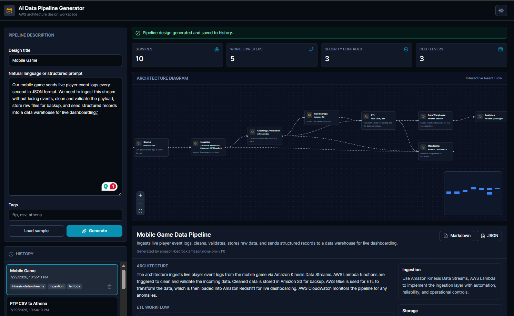
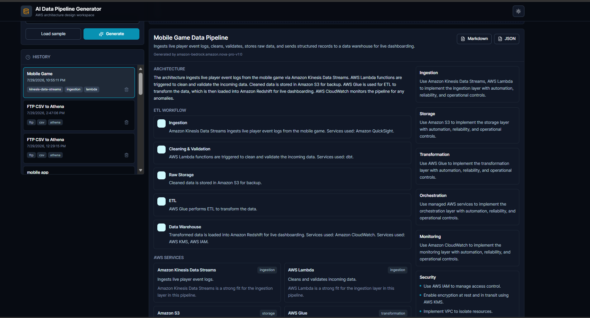
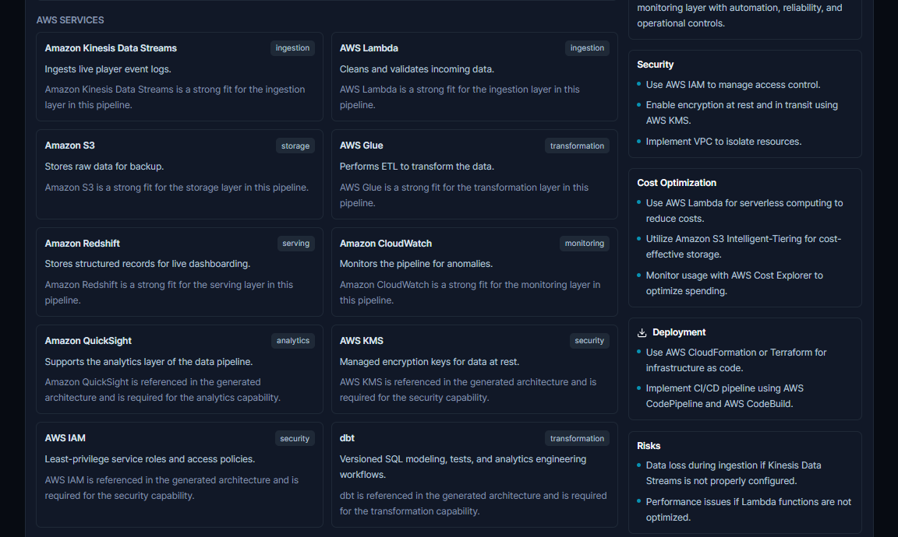
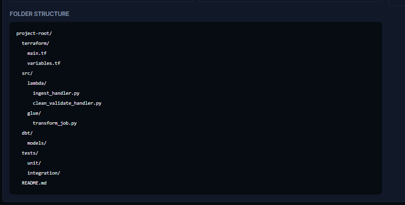
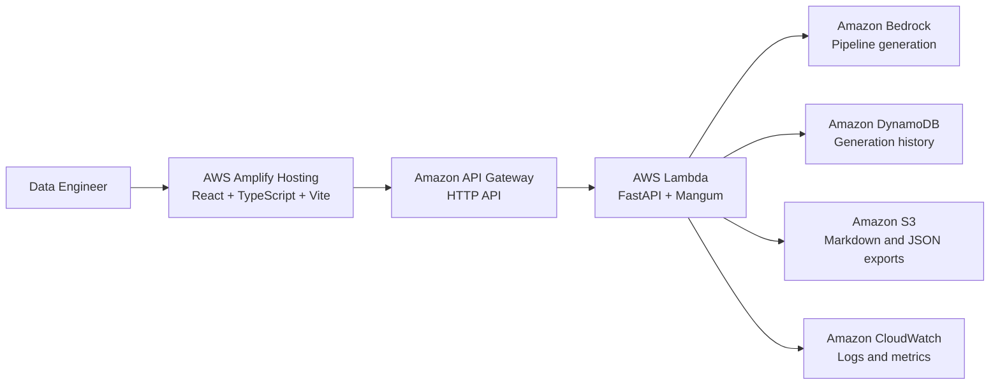
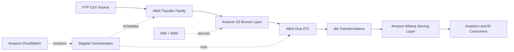

# AI Data Pipeline Generator

AI Data Pipeline Generator is a production-oriented full-stack MVP for data engineers. It turns natural language or structured pipeline notes into an AWS-native data architecture, ETL workflow, interactive diagram, service recommendations, and exportable documentation.

## Live Demo

Live application: https://dev.d273q6bevgfbgl.amplifyapp.com

## Highlights

- Generate AWS data pipeline architectures from natural language prompts.
- Use Amazon Bedrock through a FastAPI backend for AI architecture generation.
- Display interactive architecture diagrams with React Flow and automatic layout.
- Save and reopen previous pipeline designs.
- Export generated designs as Markdown and JSON.
- Run locally with deterministic mock generation when AWS credentials are unavailable.
- Deploy the full stack with AWS CDK, Lambda, API Gateway, DynamoDB, S3, and Amplify Hosting.

## Screenshots

### Dashboard



### Generated Architecture



### Pipeline Specification



### History and Export



## Application Architecture



## Generated Pipeline Architecture



## Example Prompt

```yaml
Pipeline:
  Source:
    - FTP CSV
  Ingestion:
    - AWS Transfer Family
  Storage:
    - Amazon S3 Bronze
  Transformation:
    - AWS Glue
    - dbt
  Orchestration:
    - Dagster
  Serving:
    - Amazon Athena
  Monitoring:
    - CloudWatch
  Security:
    - IAM
    - KMS
```

## Copy-Paste Test Prompts

Use these prompts to test different pipeline patterns and verify service selection, architecture diagrams, workflow generation, security guidance, and export output.

### 1. Real-Time Event Streaming

Use this to test streaming architecture, real-time ingestion, and database selection.

```text
Our mobile game sends live player event logs every second in JSON format. We need to ingest this stream without losing events, clean and validate the payload, store raw files for backup, and send structured records into a data warehouse for live dashboarding.
```

Suggested tags:

```text
realtime, json, streaming, logs
```

### 2. Enterprise Batch and Change Data Capture

Use this to test multi-tool orchestration, complex ETL workflows, and security/cost controls.

```text
We want to sync our production PostgreSQL database with our analytical platform every night at midnight. The pipeline should extract changed records, run transformation models using dbt, orchestrate the dependencies using Dagster, and store curated data in S3 using Parquet format for Athena querying. Must include KMS encryption and CloudWatch alerts.
```

Suggested tags:

```text
batch, cdc, postgres, dbt, dagster
```

### 3. REST API Ingestion and Web Scraping

Use this to test API-driven workflows, serverless triggers, and folder structure generation.

```text
I need to fetch hourly web traffic data from a third-party REST API. The API returns nested JSON files. I want an automated lambda trigger to fetch the data, normalize the JSON into flat tables, save the clean version in S3, and trigger a notification if the API fails or returns an error.
```

Suggested tags:

```text
rest-api, json, hourly, automated
```

## Tech Stack

| Layer | Technology |
| --- | --- |
| Frontend | React, TypeScript, Vite |
| Styling | Tailwind CSS |
| Diagrams | React Flow, Dagre |
| Backend | Python, FastAPI, Pydantic, Mangum |
| AI | Amazon Bedrock Converse API |
| Storage | Amazon DynamoDB, Amazon S3 |
| Infrastructure | AWS CDK, CloudFormation |
| Hosting | AWS Amplify Hosting |
| Package Manager | npm |

## Key Features

| Feature | Description |
| --- | --- |
| Pipeline prompt | Accepts natural language and structured YAML-style requirements. |
| AI generation | Produces architecture summary, workflow steps, AWS services, security, monitoring, cost guidance, deployment notes, and risks. |
| Diagram view | Renders pipeline components with React Flow and automatic Dagre layout. |
| History | Saves generated designs in DynamoDB and allows reopening previous work. |
| Export | Downloads Markdown documentation and JSON pipeline specifications. |
| Fallback mode | Provides deterministic local generation when Bedrock is unavailable. |
| Dark mode | Supports a responsive dashboard UI with dark-mode styling. |

## Repository Layout

| Path | Purpose |
| --- | --- |
| `frontend/` | React, TypeScript, Vite, Tailwind, and React Flow UI. |
| `backend/` | FastAPI application, Bedrock integration, history persistence, exports, tests. |
| `infrastructure/` | AWS CDK stack for Lambda, API Gateway, DynamoDB, S3, IAM, CloudWatch, and Amplify. |
| `scripts/` | Local start scripts, deployment scripts, and deployment verification helper. |
| `docs/` | AWS service notes, deployment guide, and README images. |
| `examples/` | Example generation request payloads. |

## Local Development

### Prerequisites

- Node.js 20 or newer
- npm 10 or newer
- Python 3.12 recommended
- AWS CLI for Bedrock-backed local generation
- AWS credentials only when `USE_MOCK_AI=false`

### Install Dependencies

```bash
npm install
```

### Configure Backend

```powershell
cd backend
python -m venv .venv
.\.venv\Scripts\Activate.ps1
pip install -r requirements-dev.txt
copy .env.example .env
```

For local development without AWS credentials:

```bash
USE_MOCK_AI=true
```

### Run Backend

```powershell
cd backend
$env:PYTHONPATH="."
uvicorn app.main:app --reload --port 8000
```

### Run Frontend

```bash
npm --workspace frontend run dev
```

Open the Vite development URL, usually `http://localhost:5173`.

## Environment Variables

### Backend

| Variable | Purpose |
| --- | --- |
| `AWS_REGION` | Selected AWS Region for Bedrock, S3, and DynamoDB. |
| `BEDROCK_MODEL_ID` | Bedrock model or inference profile ID. |
| `BEDROCK_MAX_TOKENS` | Explicit max output tokens for quota control. |
| `BEDROCK_TEMPERATURE` | Model generation temperature. |
| `HISTORY_TABLE_NAME` | DynamoDB table name for saved generations. |
| `EXPORT_BUCKET_NAME` | S3 bucket name for exported artifacts. |
| `USE_MOCK_AI` | Enables deterministic local fallback generation. |
| `ENABLE_FALLBACK` | Falls back to deterministic generation after Bedrock errors. |
| `CORS_ORIGINS` | Comma-separated browser origins. |

### Frontend

| Variable | Purpose |
| --- | --- |
| `VITE_API_BASE_URL` | Backend API base URL. |
| `VITE_DEFAULT_USER_ID` | Placeholder user identity for MVP history records. |

## AWS Services

| Service | Role in the Application |
| --- | --- |
| AWS Amplify Hosting | Hosts the static Vite frontend. |
| Amazon API Gateway | Exposes the backend as an HTTPS API. |
| AWS Lambda | Runs the FastAPI backend through Mangum. |
| Amazon Bedrock | Generates pipeline architectures from prompts. |
| Amazon DynamoDB | Stores generation history. |
| Amazon S3 | Stores exported Markdown and JSON artifacts. |
| Amazon CloudWatch | Provides logs and operational telemetry. |
| AWS X-Ray | Supports backend request tracing. |
| AWS IAM | Grants least-privilege service-to-service permissions. |
| AWS CDK | Defines and deploys the cloud infrastructure. |

## Deployment

### Bootstrap CDK

Run once per selected Region:

```bash
cd infrastructure
npx cdk bootstrap
```

### Deploy on Windows

```powershell
npm run deploy -- -Stage dev -Region ap-southeast-2 -Profile aws-beta -BedrockModelId amazon.nova-pro-v1:0
```

### Deploy on macOS or Linux

```bash
STAGE=dev AWS_REGION=ap-southeast-2 BEDROCK_MODEL_ID=amazon.nova-pro-v1:0 bash scripts/deploy-all.sh
```

The deployment script:

1. Deploys API Gateway, Lambda, DynamoDB, S3, IAM permissions, CloudWatch log retention, and Amplify Hosting with CDK.
2. Reads the backend API URL from CDK outputs.
3. Builds the Vite frontend with `VITE_API_BASE_URL`.
4. Uploads the static bundle to Amplify Hosting.

## Testing

Run backend tests:

```powershell
cd backend
$env:PYTHONPATH="."
.\.venv\Scripts\python.exe -m pytest -q
```

Run frontend and infrastructure checks:

```bash
npm run build
```

## Security Notes

- Do not commit `.env`, deployment outputs, AWS credentials, local caches, virtual environments, or build artifacts.
- Use IAM roles and least-privilege policies for service-to-service access.
- Keep Bedrock, S3, DynamoDB, and CloudWatch permissions scoped to the resources required by the application.
- Use AWS-managed or customer-managed encryption controls according to the production data classification.

## Production Hardening Backlog

- Add authentication with Amazon Cognito.
- Add per-user authorization and tenant-aware history access.
- Add API rate limiting and abuse protection.
- Add structured Lambda logging, metrics, alarms, and dashboards.
- Add Bedrock guardrails and prompt/version management.
- Add CI/CD with dependency scanning, backend tests, frontend build checks, and CDK diff gates.
- Add integration tests against a dedicated non-production AWS project.
